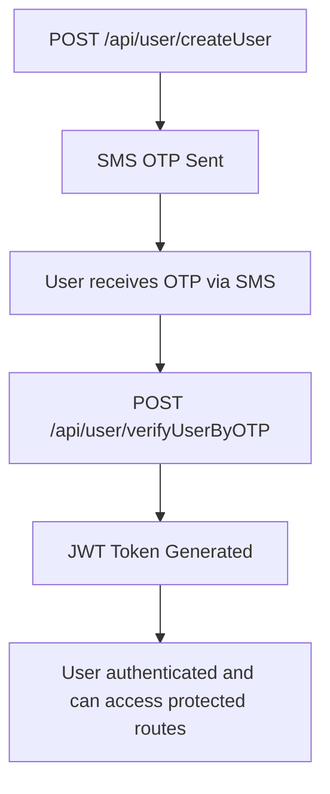
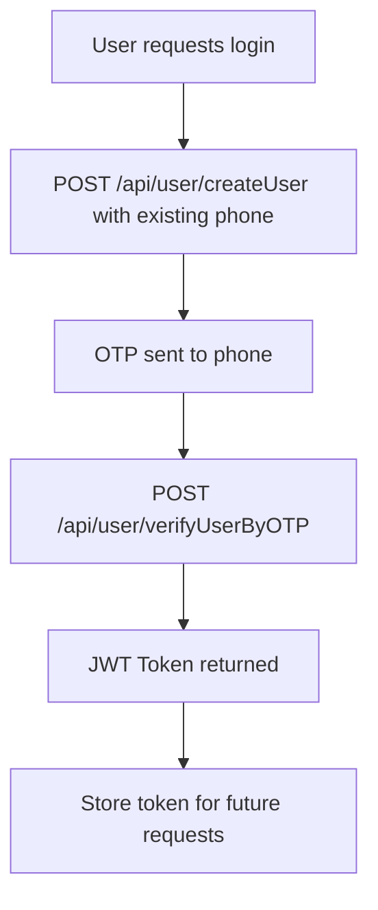
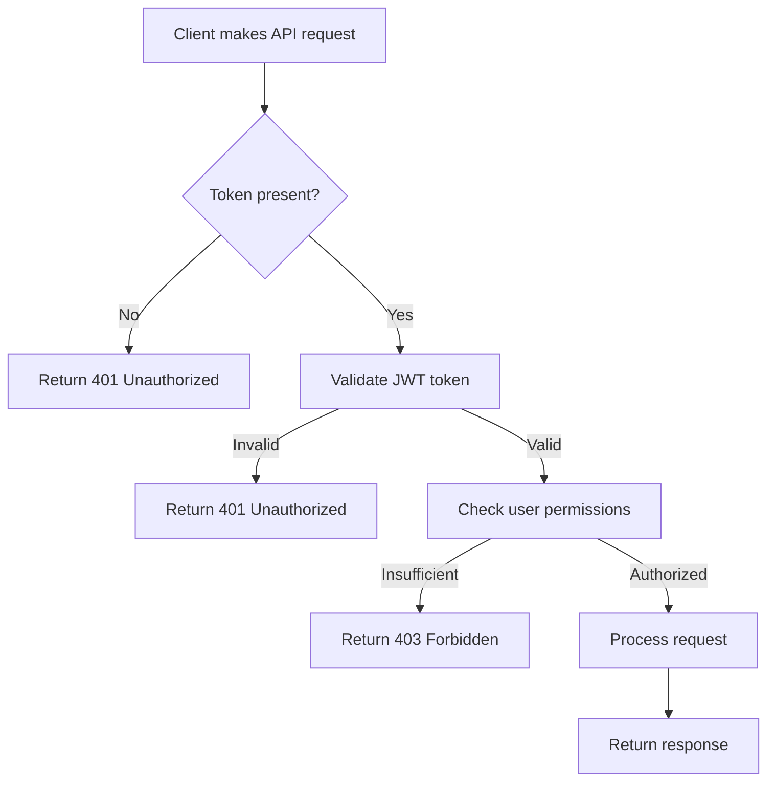

# Authentication & Security

Comprehensive guide to authentication, authorization, and security features of the Transport Management System API.

## JWT Token Management

### Token Storage & Handling

**Web Applications:**
```javascript
// Store token after login
localStorage.setItem('authToken', token);

// Retrieve token for API calls
const token = localStorage.getItem('authToken');

// Include in API requests
const response = await fetch('/api/user/profile', {
  headers: {
    'Authorization': `Bearer ${token}`,
    'Content-Type': 'application/json'
  }
});
```

**React Native (Mobile):**
```javascript
import AsyncStorage from '@react-native-async-storage/async-storage';

// Store token
await AsyncStorage.setItem('authToken', token);

// Retrieve token
const token = await AsyncStorage.getItem('authToken');

// Clear token on logout
await AsyncStorage.removeItem('authToken');
```

**Postman/Testing:**
Store tokens in environment variables and reference them in requests.

### Token Structure
JWT tokens contain three parts: header, payload, and signature.

```json
// Decoded payload example
{
  "userUniqueId": "ef226a60-08d1-4b0e-aaa6-de3f26d67d94",
  "fullName": "John Doe",
  "phoneNumber": "+1234567890",
  "roleId": 2,
  "iat": 1640995200,
  "exp": 1641081600
}
```

### Token Expiration & Refresh

- **Expiration**: 24 hours from issuance
- **Refresh**: Implement automatic token renewal for active sessions
- **Invalidation**: Tokens are invalidated on logout or password change

### Token Security Best Practices

- Never store tokens in URL parameters
- Use HTTPS for all API communications
- Implement token rotation for high-security operations
- Clear tokens from storage on logout
- Validate token signatures server-side

## Role-Based Access Control (RBAC)

### User Roles & Permissions

| Role ID | Role Name | Permissions |
|---------|-----------|-------------|
| 1 | **Passenger** | Ride requests, payments, profile management, journey tracking |
| 2 | **Driver** | Accept requests, location updates, earnings, vehicle registration, document uploads |
| 3 | **Admin** | User management, system monitoring, approvals, document verification, journey oversight |
| 4 | **Super Admin** | All admin permissions + user creation, role management, system configuration |

### Permission Matrix

#### Passenger Permissions
- ✅ Create ride requests
- ✅ View own requests and journeys
- ✅ Make payments
- ✅ Update profile
- ✅ Rate completed journeys

#### Driver Permissions
- ✅ View available ride requests
- ✅ Accept/reject ride requests
- ✅ Update location and availability
- ✅ View earnings and payment history
- ✅ Upload required documents
- ✅ Manage vehicle information

#### Admin Permissions
- ✅ View all users and filter by criteria
- ✅ Approve/reject driver documents
- ✅ Monitor system statistics
- ✅ View all ongoing journeys
- ✅ Approve user deposits
- ✅ Manage system settings

#### Super Admin Permissions
- ✅ All Admin permissions
- ✅ Create new admin users
- ✅ Manage user roles
- ✅ System-wide configuration
- ✅ Access to all administrative functions

## API Security Features

### Rate Limiting

The API implements rate limiting to prevent abuse and ensure fair usage:

| User Type | Requests per Hour | Requests per Minute |
|-----------|-------------------|---------------------|
| Anonymous | 100 | 10 |
| Authenticated Users | 1,000 | 100 |
| Admin Users | 5,000 | 500 |

**Rate Limit Headers:**
```
X-RateLimit-Limit: 1000
X-RateLimit-Remaining: 950
X-RateLimit-Reset: 1640995200
X-RateLimit-Retry-After: 3600
```

### Input Validation & Sanitization

- **Joi Schema Validation**: All input data is validated against predefined schemas
- **XSS Protection**: Input sanitization prevents cross-site scripting attacks
- **SQL Injection Prevention**: Parameterized queries and input escaping
- **File Upload Security**: Type, size, and content validation for uploads

### CORS Configuration

- **Development**: Relaxed CORS for localhost origins
- **Production**: Strict CORS allowing only authorized domains
- **Preflight Requests**: Automatic handling of OPTIONS requests

### Security Headers (Helmet.js)

```javascript
// Applied security headers
Content-Security-Policy: default-src 'self'
X-Content-Type-Options: nosniff
X-Frame-Options: DENY
X-XSS-Protection: 1; mode=block
Strict-Transport-Security: max-age=31536000
```

## Authentication Flow

### 1. User Registration


### 2. Login Flow (OTP-based)


### 3. API Request Flow


## Authorization Middleware

### Token Verification
```javascript
// verifyTokenOfAxios middleware
const verifyTokenOfAxios = (req, res, next) => {
  const token = req.headers.authorization?.replace('Bearer ', '');

  if (!token) {
    return res.status(401).json({
      message: 'error',
      error: 'Authentication token required'
    });
  }

  try {
    const decoded = jwt.verify(token, process.env.SECRET_KEY);
    req.user = decoded;
    next();
  } catch (error) {
    return res.status(401).json({
      message: 'error',
      error: 'Invalid or expired token'
    });
  }
};
```

### Role-Based Authorization
```javascript
// verifyAdminsIdentity middleware
const verifyAdminsIdentity = (req, res, next) => {
  if (!req.user) {
    return res.status(401).json({
      message: 'error',
      error: 'Authentication required'
    });
  }

  if (req.user.roleId !== 3) { // Admin role
    return res.status(403).json({
      message: 'error',
      error: 'Admin access required'
    });
  }

  next();
};

// verifyIfUserIsSupperAdmin middleware
const verifyIfUserIsSupperAdmin = (req, res, next) => {
  if (!req.user) {
    return res.status(401).json({
      message: 'error',
      error: 'Authentication required'
    });
  }

  if (req.user.roleId !== 4) { // Super Admin role
    return res.status(403).json({
      message: 'error',
      error: 'Super Admin access required'
    });
  }

  next();
};
```

## Security Best Practices for Clients

### Token Management
- Store tokens securely (localStorage for web, AsyncStorage/Keychain for mobile)
- Implement automatic token refresh before expiration
- Clear tokens on logout or token expiration
- Never log tokens in client-side logs

### API Request Security
```javascript
// Secure API request function
const secureApiCall = async (endpoint, options = {}) => {
  const token = await getStoredToken();

  if (!token) {
    throw new Error('No authentication token available');
  }

  const response = await fetch(endpoint, {
    ...options,
    headers: {
      ...options.headers,
      'Authorization': `Bearer ${token}`,
      'Content-Type': 'application/json',
    },
  });

  if (response.status === 401) {
    // Token expired, redirect to login
    clearStoredToken();
    redirectToLogin();
    throw new Error('Authentication expired');
  }

  return response;
};
```

### Mobile App Security
- Use secure storage for tokens (Keychain on iOS, EncryptedSharedPreferences on Android)
- Implement certificate pinning for API calls
- Validate SSL certificates
- Implement proper session management

### Web App Security
- Use secure cookies for token storage if localStorage is not suitable
- Implement CSRF protection for state-changing operations
- Validate all user inputs client-side before sending
- Implement proper error handling without exposing sensitive information

## Security Monitoring

### Authentication Logs
- Login attempts (successful and failed)
- Token generation and validation
- Permission checks and denials
- Suspicious activity detection

### Rate Limiting Monitoring
- Track rate limit violations
- Monitor API usage patterns
- Identify potential abuse or attacks
- Implement automatic blocking for malicious IPs

### Security Incident Response
- Automatic alerts for security events
- Token blacklisting for compromised accounts
- IP blocking for malicious activity
- Incident logging and investigation support

## Data Protection

### Encryption
- Password hashing with strong algorithms
- JWT token encryption
- Database encryption for sensitive data
- SSL/TLS for all data in transit

### Privacy Compliance
- Minimal data collection principles
- User consent for data processing
- Data retention policies
- Right to data deletion (GDPR compliance)

### Audit Logging
- Track all authentication events
- Log permission changes
- Record sensitive data access
- Maintain audit trails for compliance

## Testing Authentication

### Postman Setup
1. Create environment variables for tokens
2. Set up login request to get initial token
3. Configure automatic token refresh
4. Test protected endpoints with different roles

### Automated Testing
```javascript
// Example authentication test
describe('Authentication', () => {
  let authToken;

  beforeAll(async () => {
    // Register and verify user to get token
    const response = await request(app)
      .post('/api/user/verifyUserByOTP')
      .send({
        roleId: 1,
        OTP: '123456',
        phoneNumber: '+1234567890'
      });

    authToken = response.body.token;
  });

  test('should access protected route with valid token', async () => {
    const response = await request(app)
      .get('/api/user/profile')
      .set('Authorization', `Bearer ${authToken}`);

    expect(response.status).toBe(200);
  });

  test('should reject request without token', async () => {
    const response = await request(app)
      .get('/api/user/profile');

    expect(response.status).toBe(401);
  });
});
```

This comprehensive authentication and security system ensures that your Transport Management API is secure, properly authorized, and follows industry best practices for API security.
